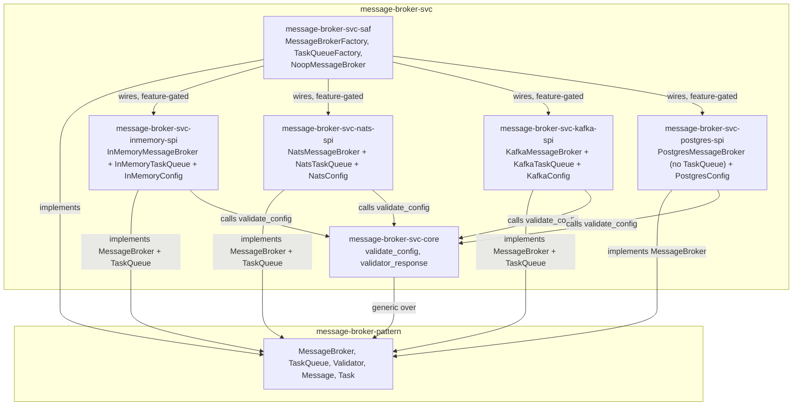

# message-broker-svc Architecture

**Audience**: Architects, technical leads, contributors.

## Overview

Six crates — one shared `core`, four `spi` providers, and one `saf` facade:

- **`message-broker-svc-core`** — generic implementation code every `spi` crate depends
  on, exploiting `message-broker-pattern`'s own `Validator` trait bound directly:
  `validate_config<C: Validator>` and `validator_response<C: Validator>`. See "Why
  `core` exists" below.
- **`message-broker-svc-inmemory-spi`** — `InMemoryMessageBroker`
  (`tokio::sync::broadcast`) + `InMemoryTaskQueue` (`tokio::sync::mpsc`) +
  `InMemoryConfig` (no fields — this backend takes no runtime parameters). Real,
  in-process pub/sub with full fan-out, restoring the functionality
  `edge-message-broker`'s own extraction left behind — see "Restoring the real
  in-memory backend" below.
- **`message-broker-svc-nats-spi`** — `NatsMessageBroker` + `NatsTaskQueue`
  (`async-nats`, `TaskQueue` via JetStream for competing-consumer semantics) +
  `NatsConfig` (this crate's own `[message_broker]` TOML config shape: `url`).
- **`message-broker-svc-kafka-spi`** — `KafkaMessageBroker` + `KafkaTaskQueue`
  (`rdkafka`) + `KafkaConfig` (`url`, `group_id`). Each `MessageBroker::subscribe()`
  call derives its own unique consumer-group ID so multiple subscribers fan out
  (pub/sub) rather than compete for partitions (Kafka's native behavior within one
  group); `KafkaTaskQueue` uses the caller-supplied `group_id` directly, since
  competing consumption is exactly what a task queue wants.
- **`message-broker-svc-postgres-spi`** — `PostgresMessageBroker` (`sqlx` + the `pgmq`
  Postgres extension) + `PostgresConfig` (`url`, `queue_name`). Delivery is **queue**
  semantics (one consumer per message), not broadcast — the one backend here that
  doesn't fan out. No `TaskQueue` implementation — `edge-runtime`'s original pilot
  never had one for Postgres either.
- **`message-broker-svc-saf`** — `MessageBrokerFactory` (`noop`/`in_memory`/`nats`/
  `kafka`/`postgres`) and `TaskQueueFactory` (`in_memory`/`nats`/`kafka`, no
  `postgres`), plus the reference no-op implementation (`NoopMessageBroker`/
  `NoopValidator`, `pub(crate)`, reachable only via `MessageBrokerFactory::noop()`).
  A consumer depends on `message-broker-pattern` + `message-broker-svc-saf` alone
  and never imports a `spi` crate directly — enforced, not a convention left to
  discipline (`NatsMessageBroker`/`NatsTaskQueue` etc. are `pub` within their own
  `spi` crates only, never re-exported from `saf`).

Each `spi` crate depends on `message-broker-pattern` (the `MessageBroker`/`TaskQueue`/
`Validator` traits and value types), `message-broker-svc-core` (the one shared, generic
implementation every backend reuses), and whatever technology client it wraps —
`message-broker-svc-saf` is the only thing that depends on all four `spi` crates
together.

## Restoring the real in-memory backend

`edge-message-broker`'s own extraction into this repo left one real gap: it ported
`NoopMessageBroker` (discards published messages) but not
`edge-runtime`'s real `runtime-message-broker-core::InMemoryMessageBroker`
(`tokio::sync::broadcast`-backed, genuinely delivers to every subscriber). That gap was
initially believed harmless -- `BackendKind`/`MessageBrokerConfig` (the vocabulary
`edge-runtime`'s own dispatch used to select it) were being removed as an anti-pattern
anyway, and it looked like nothing outside `edge-message-broker` itself depended on the
removed vocabulary.

That belief was checked against `edge-runtime`'s actual source, not assumed: `edge-runtime`'s
`runtime-message-broker-contract` crate re-exports `swe_edge_message_broker::{BackendKind,
MessageBrokerConfig}` directly, and `runtime-message-broker-saf`'s
`MessageBrokerFactory::from_config`/`impl BrokerProvider for MessageBrokerFactory` is a
real, currently-live dispatch function pinned via git tag `v0.3.8`, one of whose four
branches constructs a real `InMemoryMessageBroker`. The in-memory backend is not
hypothetical, unused vocabulary -- it is live functionality `edge-runtime` depends on
today.

**Decision**: added `message-broker-svc-inmemory-spi`, restoring `InMemoryMessageBroker`
faithfully (topic length/emptiness checks, `DEFAULT_CHANNEL_CAPACITY`-bounded broadcast
channels, lazy per-topic channel creation, `StreamLagged` on receiver lag) -- ported
1:1 from `edge-runtime`'s own implementation, not reinvented. `InMemoryConfig` (zero
fields, since this backend takes no runtime parameters) implements
`Validator`/`OptionalSection` the same way every other `spi` crate's config does, for
the same reason: `MessageBroker::validator()` needs a return value, and
presence/absence of an empty `[message_broker]` section still has real,
`deny_unknown_fields`-enforced meaning.

**What is not restored, deliberately**: the `BackendKind`-driven `from_config`/
`BrokerProvider` dispatch mechanism itself. That capability's correct home is a
`runtime-svc-registry`-based composition layer built on top of this repo's independent
constructors (`MessageBrokerFactory::in_memory`/`nats`/`kafka`/`postgres`), living in
`edge-runtime`'s own repo -- not a `BackendKind`-shaped enum reintroduced here. Bringing
that enum back would undo the correctly-identified anti-pattern removal (a contract or
contract-adjacent vocabulary must never enumerate specific technology names); the fix
for "how does a downstream composition site pick a backend at runtime" is the registry
pattern already established elsewhere in this org, not a regression to the shape that
was removed. `edge-message-broker#6`'s own E3 already tracks updating `edge-runtime#96`'s
pilot scope to depend on this repo instead of its own divergent in-tree copy and the
still-live `swe-edge-message-broker` git-tag dependency -- not resolved by this
amendment, which only closes the backend-implementation gap, not the composition-layer
gap.

## Why `core` exists

Mirrors `ledger`'s own split: `LedgerPayload` (the trait) lives in `ledger-base-port`,
pure port crate, zero implementation — but the *generic, reusable implementation* that
exploits it (`RedbLogStore<P: LedgerPayload>`, `GrpcNetwork
`, the whole raft
replication stack) lives in `ledger`'s own `adapter/replication` crate, never inside
`ledger-base-port` itself. Every downstream consumer (`a2a-ledger`'s `TaskEvent`,
`a2ac-ledger`'s own payload type) brings its own shape and gets that shared machinery
for free.

`message-broker-pattern` is this repo's `ledger-base-port` equivalent: `Validator` (the
trait) and nothing else — no generic function, no reusable algorithm, just the trait
signature. `message-broker-svc-core` is this repo's `adapter/replication` equivalent:
the one place `Validator`'s bound gets a real, generic implementation
(`validate_config<C: Validator>`), reused identically by `NatsConfig`/`KafkaConfig`/
`PostgresConfig` — each `spi` crate brings its own config shape, calls
`message_broker_svc_core::validate_config(&config)?` once in its own constructor, and
gets the same validate-then-map-to-`BrokerError` behavior every other backend gets,
without duplicating it. Before this crate existed, three backends validated construction
three different ways: NATS hand-rolled its own empty-`url` check, Kafka and Postgres
validated nothing at all. Adding a fourth backend later means implementing `Validator`
on its own config type and calling this one function — not inventing a fourth approach.

A comprehensive pass over every `MessageBroker` method (checking each against "is this
forced to be technology-specific, or is it duplicated logic that only touches
`message-broker-pattern`'s own types?") found a second case: every implementor's
`validator()` body — `NatsMessageBroker`, `KafkaMessageBroker`, `PostgresMessageBroker`,
`NoopMessageBroker` — was the byte-for-byte identical one-liner
`Arc::clone(&self.config) as Arc<dyn Validator>`, wrapped in `ValidatorResponse`. `core`
now provides `validator_response<C: Validator>(config: &Arc<C>) -> ValidatorResponse`;
every implementor's `validator()` is one line calling it. `publish`/`subscribe`/
`health_check` were checked the same way and found genuinely forced to be concrete —
each talks to a different wire protocol (`async-nats`, `rdkafka`, `sqlx`/`pgmq`) with no
shared algorithm underneath to extract, unlike `validate_config`/`validator_response`
which touch only `message-broker-pattern`'s own vocabulary.

## Config: each `spi` crate owns its own, none shared

There is no crate-spanning "which backend" type anywhere in this repo — no enum, no
shared config struct, no `from_config` dispatch. Each `spi` crate defines its own local
config type (`NatsConfig`, `KafkaConfig`, `PostgresConfig`), independently implementing:

- `configbuilder::OptionalSection` — real `[message_broker]` TOML-section loading
  (presence-based enabling, `deny_unknown_fields`, cross-field validation).
- `message-broker-pattern`'s own `Validator` — the trait `MessageBroker::validator()`
  requires a return value for; each broker holds `Arc<its-own-Config>` and hands it back
  directly. Each constructor also calls `message-broker-svc-core`'s
  `validate_config(&config)` once, before doing any I/O — see "Why `core` exists" above.

This follows `edge-llm`'s own precedent (`provider/contract`'s doc comment): a contract
type must never implement a foreign trait like `OptionalSection` itself — that would be
real implementation code, and the orphan rule means no other crate could write it
either, making the capability unimplementable anywhere. A downstream adapter crate that
needs TOML-section loading defines its own local type instead. Each `spi` crate here
*is* that downstream adapter.

Why not centralize these three types in `-saf` instead (mirroring, say, a facade that
owns config for the types it constructs)? Because each broker holds and returns its own
config via `validator()` — putting the config type in `-saf` while the broker that needs
it lives in the `spi` crate would make the `spi` crate depend on `-saf`, inverting the
real dependency direction (`-saf` depends on the `spi` crates, not the reverse).

## Component Diagram

## Dispatch: independent constructors per trait, no shared selection type

`MessageBrokerFactory::noop()` / `::in_memory()` / `::nats(url)` /
`::kafka(brokers, group_id)` / `::postgres(dsn, queue_name)` — five independent,
directly-typed, Cargo-feature-gated (except `noop`, always available) associated
functions. No enum or config value ties them together, and no runtime branch picks
among several compiled-in backends by name.
A given build of this crate compiles in whichever features are turned on; the caller
already knows, at the point they write the one line calling a specific constructor,
which backend that build is for.

All five return `Box<dyn MessageBroker>` — not four returning opaque
`impl MessageBroker` and one (`noop`) returning `Box<dyn MessageBroker>`, which is what
this looked like before an audit pass caught the inconsistency. `impl Trait` in return
position is a distinct anonymous type per function; a caller who picks a backend at
runtime (`if cfg.backend == "kafka" { ... } else { MessageBrokerFactory::noop() }`)
could not have unified three of these four constructors into one variable without
manually boxing them itself — the trait was supposed to hide exactly that construction
detail, but three call sites leaked it anyway. Fixed uniformly; every constructor's
result now behaves identically as far as the caller is concerned, and
`message_broker_factory_int_test.rs::test_kafka_and_noop_constructors_return_the_same_boxed_broker_type`
is a real regression test for it — before this fix, that test's own `Vec<Box<dyn
MessageBroker>>` literal would have failed to *compile*, not just to pass.

`TaskQueueFactory::in_memory()` / `::nats(nats_url, stream_name, consumer_group)` /
`::kafka(brokers, group_id, topic)` — the same shape, one crate over: three
independent, directly-typed, feature-gated constructors, no `postgres` (no
`TaskQueue` backend exists for it) and no no-op reference (no `TaskQueue`
equivalent of `noop()` exists either — a task queue that always returns `None`
from `dequeue()` was judged not worth a dedicated type). All three return
`Box<dyn TaskQueue>`, for the same reason `MessageBrokerFactory`'s five
constructors were unified: a caller collecting queues from more than one
constructor into one `Vec` needs them to actually be the same type.
`kafka_task_queue_int_test.rs::test_kafka_and_in_memory_constructors_return_the_same_boxed_queue_type`
is `TaskQueueFactory`'s own version of that regression test.

**This is deliberate, not an oversight.** A `from_config` that matches on a
"which-backend" value and constructs the matching one of several compiled-in
implementations *is* a registry — exactly the job `runtime-svc-registry` (built on
`svc-registry-pattern`'s `Named`/`Registry<T>`) already exists to do generically. This
repo represents exactly one implementation at a time per build; a caller that needs
runtime selection among multiple named backends builds that on top using
`runtime-svc-registry`'s own pattern, rather than this repo reinventing a bespoke,
closed-enum version of it internally.

## Scope boundary

This repo covers `message-broker-pattern`'s `MessageBroker` **and** `TaskQueue` traits
(both now live in that one pattern crate — see its own architecture doc), extracted
from `edge-runtime`'s own in-tree pilot (`ec34244`/`16ec508`). One thing from that
pilot remains deliberately **not** ported:

- **`ApplicationConfig`/`BrokerProvider`** — `edge-runtime`-specific composition
  abstractions layered on top of `MessageBrokerFactory`, and the `BackendKind`-driven
  `from_config` dispatch mechanism itself. Not part of `message-broker-pattern`, and
  this repo has no dependency on `edge-runtime`. See "Restoring the real in-memory
  backend" above for why the *backend itself* (unlike this dispatch layer) has since
  been ported.

**Update (in-memory backend)**: the real, `tokio::sync::broadcast`-backed in-memory
`MessageBroker` (`edge-runtime`'s own `runtime-message-broker-core::InMemoryMessageBroker`)
was initially left out alongside the above, on the belief that nothing outside
`edge-message-broker` depended on it. That belief was wrong — see "Restoring the real
in-memory backend" above — and this backend now ships here as
`message-broker-svc-inmemory-spi`, distinct from `NoopMessageBroker` (which still just
discards published messages; `MessageBrokerFactory::noop()` is unchanged).

**Update (`TaskQueue`)**: this repo originally excluded `TaskQueue` entirely —
`edge-runtime`'s own richer contract (`runtime-message-broker-contract`, a superset
adding `TaskQueue`/`Task`/`TaskHandle`) and each backend's `*TaskQueue` implementation
— reasoning that `KafkaMessageBroker`/`NatsMessageBroker` split cleanly from their
`*TaskQueue` siblings in the source they were extracted from (separate files, no shared
state), so leaving `TaskQueue` out was a clean cut. That framed it as a scope decision;
it was actually the same class of gap as the in-memory backend above — `TaskQueue`
belongs in `message-broker-pattern` alongside `MessageBroker`, and a consumer is
supposed to get this domain's whole primitive set from `message-broker-pattern` plus
this repo, not half of it redefined downstream in `edge-runtime`. `TaskQueue` is now
implemented here too: `message-broker-svc-inmemory-spi::InMemoryTaskQueue`,
`message-broker-svc-nats-spi::NatsTaskQueue`, `message-broker-svc-kafka-spi::KafkaTaskQueue`
(`message-broker-svc-postgres-spi` has none — Postgres/`pgmq` never had a `TaskQueue`
backend in `edge-runtime`'s original pilot either).

**Verified 1:1 with the pilot, not assumed**: every ported `*TaskQueue` (and its
crate-local `constants.rs`/`LoggingConsumerContext`) was diffed line-for-line against
`edge-runtime`'s own pre-deletion source. Every diff is an import-path rename
(`runtime_message_broker_pattern::` → `message_broker_pattern::`) or a doc-comment
correction (a stale `async-nats 0.48` reference updated to the `0.49` actually
pinned) — zero behavioral changes. The one real addition, `NatsTaskQueue::connect`,
is the blank-URL-check-then-connect logic that used to live inline in
`edge-runtime`'s `TaskQueueFactory::nats`, relocated here so `saf` no longer needs
`async-nats` as a direct dependency for it — same logic, moved, not altered.

[← Docs index](../README.md)
