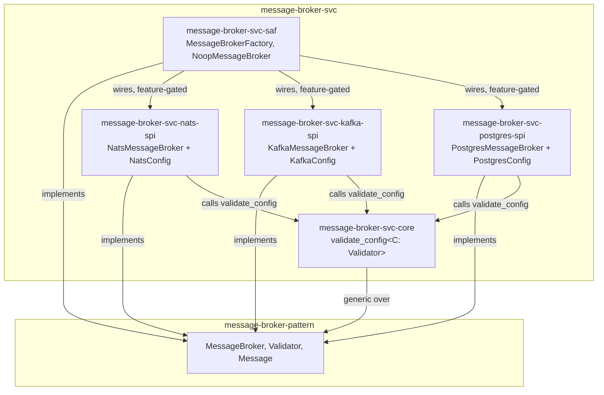

# message-broker-svc Architecture

## Overview

Five crates — one shared `core`, three `spi` providers, and one `saf` facade:

- **`message-broker-svc-core`** — generic implementation code every `spi` crate depends
  on, exploiting `message-broker-pattern`'s own `Validator` trait bound directly
  (`validate_config<C: Validator>`). See "Why `core` exists" below.
- **`message-broker-svc-nats-spi`** — `NatsMessageBroker` (`async-nats`) + `NatsConfig`
  (this crate's own `[message_broker]` TOML config shape: `url`).
- **`message-broker-svc-kafka-spi`** — `KafkaMessageBroker` (`rdkafka`) + `KafkaConfig`
  (`url`, `group_id`). Each `subscribe()` call derives its own unique consumer-group ID
  so multiple subscribers fan out (pub/sub) rather than compete for partitions (Kafka's
  native behavior within one group).
- **`message-broker-svc-postgres-spi`** — `PostgresMessageBroker` (`sqlx` + the `pgmq`
  Postgres extension) + `PostgresConfig` (`url`, `queue_name`). Delivery is **queue**
  semantics (one consumer per message), not broadcast — the one backend here that
  doesn't fan out.
- **`message-broker-svc-saf`** — `MessageBrokerFactory`, plus the reference no-op
  implementation (`NoopMessageBroker`/`NoopValidator`, `pub(crate)`, reachable only via
  `MessageBrokerFactory::noop()`). A consumer depends on `message-broker-pattern` +
  `message-broker-svc-saf` alone and never imports a `spi` crate directly — enforced,
  not a convention left to discipline (`NatsMessageBroker` etc. are `pub` within their
  own `spi` crates only, never re-exported from `saf`).

Each `spi` crate depends on `message-broker-pattern` (the `MessageBroker`/`Validator`
traits and value types), `message-broker-svc-core` (the one shared, generic
implementation every backend reuses), and whatever technology client it wraps —
`message-broker-svc-saf` is the only thing that depends on all three `spi` crates
together.

## Why `core` exists

Mirrors `ledger`'s own split: `LedgerPayload` (the trait) lives in `ledger-base-port`,
pure port crate, zero implementation — but the *generic, reusable implementation* that
exploits it (`RedbLogStore<P: LedgerPayload>`, `GrpcNetwork
`, the whole raft
replication stack) lives in `ledger`'s own `adapter/replication` crate, never inside
`ledger-base-port` itself. Every downstream consumer (`a2a-ledger`'s `TaskEvent`,
`a2ac-ledger`'s own payload type) brings its own shape and gets that shared machinery
for free.

`message-broker-pattern` is this repo's `ledger-base-port` equivalent: `Validator` (the
trait) and nothing else — no generic function, no reusable algorithm, just the trait
signature. `message-broker-svc-core` is this repo's `adapter/replication` equivalent:
the one place `Validator`'s bound gets a real, generic implementation
(`validate_config<C: Validator>`), reused identically by `NatsConfig`/`KafkaConfig`/
`PostgresConfig` — each `spi` crate brings its own config shape, calls
`message_broker_svc_core::validate_config(&config)?` once in its own constructor, and
gets the same validate-then-map-to-`BrokerError` behavior every other backend gets,
without duplicating it. Before this crate existed, three backends validated construction
three different ways: NATS hand-rolled its own empty-`url` check, Kafka and Postgres
validated nothing at all. Adding a fourth backend later means implementing `Validator`
on its own config type and calling this one function — not inventing a fourth approach.

## Config: each `spi` crate owns its own, none shared

There is no crate-spanning "which backend" type anywhere in this repo — no enum, no
shared config struct, no `from_config` dispatch. Each `spi` crate defines its own local
config type (`NatsConfig`, `KafkaConfig`, `PostgresConfig`), independently implementing:

- `configbuilder::OptionalSection` — real `[message_broker]` TOML-section loading
  (presence-based enabling, `deny_unknown_fields`, cross-field validation).
- `message-broker-pattern`'s own `Validator` — the trait `MessageBroker::validator()`
  requires a return value for; each broker holds `Arc<its-own-Config>` and hands it back
  directly. Each constructor also calls `message-broker-svc-core`'s
  `validate_config(&config)` once, before doing any I/O — see "Why `core` exists" above.

This follows `edge-llm`'s own precedent (`provider/contract`'s doc comment): a contract
type must never implement a foreign trait like `OptionalSection` itself — that would be
real implementation code, and the orphan rule means no other crate could write it
either, making the capability unimplementable anywhere. A downstream adapter crate that
needs TOML-section loading defines its own local type instead. Each `spi` crate here
*is* that downstream adapter.

Why not centralize these three types in `-saf` instead (mirroring, say, a facade that
owns config for the types it constructs)? Because each broker holds and returns its own
config via `validator()` — putting the config type in `-saf` while the broker that needs
it lives in the `spi` crate would make the `spi` crate depend on `-saf`, inverting the
real dependency direction (`-saf` depends on the `spi` crates, not the reverse).

## Component Diagram

## Dispatch: four independent constructors, no shared selection type

`MessageBrokerFactory::noop()` / `::nats(url)` / `::kafka(brokers, group_id)` /
`::postgres(dsn, queue_name)` — four independent, directly-typed, Cargo-feature-gated
(except `noop`, always available) associated functions. No enum or config value ties
them together, and no runtime branch picks among several compiled-in backends by name.
A given build of this crate compiles in whichever features are turned on; the caller
already knows, at the point they write the one line calling a specific constructor,
which backend that build is for.

**This is deliberate, not an oversight.** A `from_config` that matches on a
"which-backend" value and constructs the matching one of several compiled-in
implementations *is* a registry — exactly the job `runtime-svc-registry` (built on
`svc-registry-pattern`'s `Named`/`Registry<T>`) already exists to do generically. This
repo represents exactly one implementation at a time per build; a caller that needs
runtime selection among multiple named backends builds that on top using
`runtime-svc-registry`'s own pattern, rather than this repo reinventing a bespoke,
closed-enum version of it internally.

## Scope boundary

This repo covers only `message-broker-pattern`'s `MessageBroker` trait, extracted from
`edge-runtime`'s own in-tree pilot (`ec34244`/`16ec508`). Several things from that pilot
were deliberately **not** ported:

- **`TaskQueue`** — `edge-runtime`'s own richer contract
  (`runtime-message-broker-contract`, a superset of this contract adding `TaskQueue`/
  `Task`/`TaskHandle`) and each backend's `*TaskQueue` implementation. `KafkaMessageBroker`
  and `NatsMessageBroker` were split cleanly from their `*TaskQueue` siblings in the
  source they were extracted from (separate files, no shared state), so this was a clean
  cut, not a partial one.
- **`ApplicationConfig`/`BrokerProvider`** — `edge-runtime`-specific composition
  abstractions layered on top of `MessageBrokerFactory`. Not part of
  `message-broker-pattern`, and this repo has no dependency on `edge-runtime`.
- **The real, `tokio::sync::broadcast`-backed in-memory backend** —
  `edge-runtime`'s own `runtime-message-broker-core::InMemoryMessageBroker`, distinct
  from this repo's `NoopMessageBroker` (which discards published messages rather than
  broadcasting them). Neither this repo nor `message-broker-pattern` ships that real
  in-memory implementation today.

[← Docs index](../README.md)
