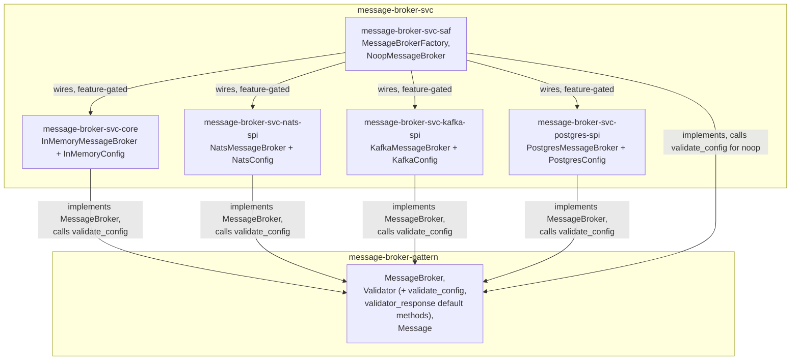

# message-broker-svc Architecture

**Audience**: Architects, technical leads, contributors.

## Overview

Five crates — one `core` reference implementation, three `spi` providers, and one
`saf` facade. There is no `spi/shared` crate — see "Why `validate_config`/
`validator_response` live on `Validator` itself, not a `spi/shared` crate" below for
why that was tried and then dissolved. There is also no `TaskQueue` implementation
here anymore — see "Why `TaskQueue` implementations moved out (SRP)" below;
`MessageBroker` is this repo's only trait now.

- **`message-broker-svc-core`** — the technology-free reference implementation:
  `InMemoryMessageBroker` (`tokio::sync::broadcast`) + `InMemoryConfig` (no fields —
  this backend takes no runtime parameters). Real, in-process pub/sub with full
  fan-out, restoring the functionality `edge-message-broker`'s own extraction left
  behind — see "Restoring the real in-memory backend" below. `core` names exactly
  this shape per this org's own convention (`runtime-resource-limit-core`,
  `edge-runtime`'s original `runtime-message-broker-core`): the pure, in-process,
  zero-external-dependency implementation a domain's traits get for free. There is
  no such thing as an "in-memory spi" — spi names a crate that wraps one *external*
  technology, and in-memory wraps nothing external. See "`core` is the reference
  implementation, not an spi" below.
- **`message-broker-svc-nats-spi`** — `NatsMessageBroker` (`async-nats`) +
  `NatsConfig` (this crate's own `[message_broker]` TOML config shape: `url`).
- **`message-broker-svc-kafka-spi`** — `KafkaMessageBroker` (`rdkafka`) +
  `KafkaConfig` (`url`, `group_id`). Each `MessageBroker::subscribe()`
  call derives its own unique consumer-group ID so multiple subscribers fan out
  (pub/sub) rather than compete for partitions (Kafka's native behavior within one
  group).
- **`message-broker-svc-postgres-spi`** — `PostgresMessageBroker` (`sqlx` + the `pgmq`
  Postgres extension) + `PostgresConfig` (`url`, `queue_name`). Delivery is **queue**
  semantics (one consumer per message), not broadcast — the one backend here that
  doesn't fan out.
- **`message-broker-svc-saf`** — `MessageBrokerFactory` (`noop`/`in_memory`/`nats`/
  `kafka`/`postgres`), plus the reference no-op implementation (`NoopMessageBroker`/
  `NoopValidator`, `pub(crate)`, reachable only via `MessageBrokerFactory::noop()`).
  A consumer depends on `message-broker-pattern` + `message-broker-svc-saf` alone
  and never imports a `spi` crate directly — enforced, not a convention left to
  discipline (`NatsMessageBroker` etc. are `pub` within their own
  `spi` crates only, never re-exported from `saf`).

Each `spi` crate depends on `message-broker-pattern` (the `MessageBroker`/
`Validator` traits and value types — `Validator` itself now carries
`validate_config`/`validator_response` as default methods, so no separate shared crate
is needed for that) and whatever technology client it wraps. `message-broker-svc-core`
has no `spi` dependency of its own — it wraps no external technology, so it has nothing
to validate a network address or credential against, but its `InMemoryMessageBroker::validator()`
impl still gets `validator_response` for free from `message-broker-pattern`'s `Validator`,
same as every other backend. `message-broker-svc-saf` is the only thing that depends on
`core` and all three real `spi` crates together.

## Restoring the real in-memory backend

`edge-message-broker`'s own extraction into this repo left one real gap: it ported
`NoopMessageBroker` (discards published messages) but not
`edge-runtime`'s real `runtime-message-broker-core::InMemoryMessageBroker`
(`tokio::sync::broadcast`-backed, genuinely delivers to every subscriber). That gap was
initially believed harmless -- `BackendKind`/`MessageBrokerConfig` (the vocabulary
`edge-runtime`'s own dispatch used to select it) were being removed as an anti-pattern
anyway, and it looked like nothing outside `edge-message-broker` itself depended on the
removed vocabulary.

That belief was checked against `edge-runtime`'s actual source, not assumed: `edge-runtime`'s
`runtime-message-broker-contract` crate re-exports `swe_edge_message_broker::{BackendKind,
MessageBrokerConfig}` directly, and `runtime-message-broker-saf`'s
`MessageBrokerFactory::from_config`/`impl BrokerProvider for MessageBrokerFactory` is a
real, currently-live dispatch function pinned via git tag `v0.3.8`, one of whose four
branches constructs a real `InMemoryMessageBroker`. The in-memory backend is not
hypothetical, unused vocabulary -- it is live functionality `edge-runtime` depends on
today.

**Decision**: added `message-broker-svc-inmemory-spi`, restoring `InMemoryMessageBroker`
faithfully (topic length/emptiness checks, `DEFAULT_CHANNEL_CAPACITY`-bounded broadcast
channels, lazy per-topic channel creation, `StreamLagged` on receiver lag) -- ported
1:1 from `edge-runtime`'s own implementation, not reinvented. `InMemoryConfig` (zero
fields, since this backend takes no runtime parameters) implements
`Validator`/`OptionalSection` the same way every other `spi` crate's config does, for
the same reason: `MessageBroker::validator()` needs a return value, and
presence/absence of an empty `[message_broker]` section still has real,
`deny_unknown_fields`-enforced meaning.

**What is not restored, deliberately**: the `BackendKind`-driven `from_config`/
`BrokerProvider` dispatch mechanism itself. That capability's correct home is a
`runtime-svc-registry`-based composition layer built on top of this repo's independent
constructors (`MessageBrokerFactory::in_memory`/`nats`/`kafka`/`postgres`), living in
`edge-runtime`'s own repo -- not a `BackendKind`-shaped enum reintroduced here. Bringing
that enum back would undo the correctly-identified anti-pattern removal (a contract or
contract-adjacent vocabulary must never enumerate specific technology names); the fix
for "how does a downstream composition site pick a backend at runtime" is the registry
pattern already established elsewhere in this org, not a regression to the shape that
was removed. `edge-message-broker#6`'s own E3 already tracks updating `edge-runtime#96`'s
pilot scope to depend on this repo instead of its own divergent in-tree copy and the
still-live `swe-edge-message-broker` git-tag dependency -- not resolved by this
amendment, which only closes the backend-implementation gap, not the composition-layer
gap.

**Amendment**: the crate this section originally shipped the in-memory backend as,
`message-broker-svc-inmemory-spi`, was later found to be misnamed against this org's own
convention — there is no such thing as an "in-memory spi", since spi names a crate that
wraps one *external* technology and in-memory wraps nothing external. Its content
(`InMemoryMessageBroker`/`InMemoryTaskQueue`/`InMemoryConfig`) moved unchanged into
`message-broker-svc-core` ([message-broker-svc#2](https://github.com/sweengineeringlabs/message-broker-svc/issues/2)); the crate itself was deleted,
not deprecated. See "`core` is the reference implementation, not an spi" below.
`InMemoryTaskQueue` itself later moved on again, to `task-queue-svc-core` — see
"Why `TaskQueue` implementations moved out (SRP)" below.

## `core` is the reference implementation, not an spi

`message-broker-svc-core` holds `InMemoryMessageBroker` —
the in-process, `tokio`-only implementation of `message-broker-pattern`'s
`MessageBroker` trait (it held `InMemoryTaskQueue` too, until that moved to
`task-queue-svc-core` for SRP — see below). It was
originally shipped as a peer `spi` crate (`message-broker-svc-inmemory-spi`), and
separately, a `message-broker-svc-core` crate existed holding only the
`validate_config`/`validator_response` free functions every real `spi` backend shared.
Both were wrong: per this org's own convention (`runtime-resource-limit-core`,
`edge-runtime`'s own original `runtime-message-broker-core`), `core` names the
zero-external-dependency reference implementation itself, not a home for shared helper
functions — and "in-memory spi" is a category error, since spi means wrapping an
external technology and in-memory wraps nothing external. Fixed by merging
`inmemory-spi`'s content into `core` verbatim ([message-broker-svc#2](https://github.com/sweengineeringlabs/message-broker-svc/issues/2)).
The former `core`'s helper functions went through two more homes after that — see
"Why `validate_config`/`validator_response` live on `Validator` itself, not a
`spi/shared` crate" below for where they ended up and why.

## Why `validate_config`/`validator_response` live on `Validator` itself, not a `spi/shared` crate

`message-broker-svc#2` first moved the former `core`'s two helper functions to a new
`message-broker-svc-spi-shared` crate, reshaped as `ValidatorExt: Validator` — an
extension trait with default-implemented `validate_config`/`validator_response`
methods, blanket-implemented for every `T: Validator`, kept out of
`message-broker-pattern` on the assumption that "zero implementation" ruled out
defining any real logic there.

[message-broker-svc#3](https://github.com/sweengineeringlabs/message-broker-svc/issues/3)
re-checked that assumption against `message-broker-pattern`'s own precedent
(`TaskQueueFactoryContract`, and the "small structural `impl`" carve-out its
architecture doc already documents: "zero implementation" means implementing none of
that crate's own primary traits for a concrete type, not that a trait declared there may
never carry a default method body) and found it didn't hold: `validate_config`/
`validator_response` touch only `Validator::validate` (the trait's own required method)
and `message-broker-pattern`'s own `BrokerError`/`ValidationRequest`/`ValidatorResponse`
— identical for every implementor, zero backend-technology vocabulary, and neither
method implements `Validator` itself for any concrete type.

Folded directly onto `Validator` as default methods in `message-broker-pattern`
(v0.1.3) — not even kept as a separate `ValidatorExt` extension trait, since none is
needed once the methods live on the trait every implementor already depends on.
`message-broker-svc-spi-shared` was deleted outright, not kept as a re-export (mirrors
this repo's own precedent: `inmemory-spi` was deleted, not deprecated, when it merged
into `core`). Every `*-spi` crate, `core`, and `saf`'s `NoopMessageBroker` now call
`self.validate_config()`/`self.validator_response()` directly via
`use message_broker_pattern::Validator;` — no extra import beyond the `Validator` trait
they already needed. See `message-broker-pattern`'s own architecture doc for the
contract-side half of this reasoning (Rust object-safety details included).

Program to the interface, not to the consumer, still holds — it just turned out the
right interface to program to was `Validator` itself, not a second trait layered on top
of it. Any backend config type that implements `Validator` gets `validate_config()`/
`validator_response()` for free through the interface itself, reused identically by
`NatsConfig`/`KafkaConfig`/`PostgresConfig`/`InMemoryConfig` — each config type calls
`self.validate_config()?` once in its own constructor and gets the same
validate-then-map-to-`BrokerError` behavior every other backend gets, without
duplicating it. Before this existed, three backends validated construction three
different ways: NATS hand-rolled its own empty-`url` check, Kafka and Postgres validated
nothing at all. Adding a fourth backend later means implementing `Validator` on its own
config type — `validate_config`/`validator_response` come for free.

A comprehensive pass over every `MessageBroker` method (checking each against "is this
forced to be technology-specific, or is it duplicated logic that only touches
`message-broker-pattern`'s own types?") found a second case: every implementor's
`validator()` body — `NatsMessageBroker`, `KafkaMessageBroker`, `PostgresMessageBroker`,
`InMemoryMessageBroker`, `NoopMessageBroker` — was the byte-for-byte identical one-liner
`Arc::clone(&self.config) as Arc<dyn Validator>`, wrapped in `ValidatorResponse`.
`Validator::validator_response(self: &Arc<Self>)` now provides that; every implementor's
`validator()` is one line calling it. `publish`/`subscribe`/`health_check` were checked
the same way and found genuinely forced to be concrete — each talks to a different wire
protocol (`async-nats`, `rdkafka`, `sqlx`/`pgmq`, or an in-process channel) with no
shared algorithm underneath to extract, unlike `validate_config`/`validator_response`
which touch only `message-broker-pattern`'s own vocabulary.

## Why `TaskQueue` implementations moved out (SRP)

`message-broker-pattern`'s own ADR-002 splits the `TaskQueue` contract out
for SRP: `MessageBroker` (fan-out/broadcast) and `TaskQueue`
(competing-consumer) have different consumers and different evolution
drivers, bundled originally for migration-completeness (see "Scope
boundary"'s own `Update (TaskQueue)` note below, preserved as history).
This repo's own implementations follow the same split:
`InMemoryTaskQueue`/`NatsTaskQueue`/`KafkaTaskQueue`/`TaskQueueFactory`
moved unchanged to a new repo,
[`task-queue-svc`](https://github.com/sweengineeringlabs/task-queue-svc) —
see that repo's own ADR-001 for the full breakdown, including what needed
duplicating across the split (some of Kafka's tuning constants, used by
both `KafkaMessageBroker` and `KafkaTaskQueue`) and what didn't (neither
`NatsTaskQueue` nor `KafkaTaskQueue` used their sibling `MessageBroker`'s
config type to begin with, so no config-type duplication was needed).

Breaking change, pre-1.0 minor bump, for every crate here that loses a
`TaskQueue` export: `core` `0.2.1 → 0.3.0`, `nats-spi` `0.1.4 → 0.2.0`,
`kafka-spi` `0.1.4 → 0.2.0`, `saf` `0.2.2 → 0.3.0`. `postgres-spi` bumps
only its `message-broker-pattern` dependency (patch, `0.1.3 → 0.1.4`) —
it never had a `TaskQueue` to lose.

## Config: each `spi` crate owns its own, none shared

There is no crate-spanning "which backend" type anywhere in this repo — no enum, no
shared config struct, no `from_config` dispatch. Each `spi` crate defines its own local
config type (`NatsConfig`, `KafkaConfig`, `PostgresConfig`), independently implementing:

- `configbuilder::OptionalSection` — real `[message_broker]` TOML-section loading
  (presence-based enabling, `deny_unknown_fields`, cross-field validation).
- `message-broker-pattern`'s own `Validator` — the trait `MessageBroker::validator()`
  requires a return value for; each broker holds `Arc<its-own-Config>` and hands it back
  directly. Each constructor also calls `Validator::validate_config(&self)` once,
  before doing any I/O — a default method on `Validator` itself, see "Why
  `validate_config`/`validator_response` live on `Validator` itself, not a `spi/shared`
  crate" above.

This follows `edge-llm`'s own precedent (`provider/contract`'s doc comment): a contract
type must never implement a foreign trait like `OptionalSection` itself — that would be
real implementation code, and the orphan rule means no other crate could write it
either, making the capability unimplementable anywhere. A downstream adapter crate that
needs TOML-section loading defines its own local type instead. Each `spi` crate here
*is* that downstream adapter.

Why not centralize these three types in `-saf` instead (mirroring, say, a facade that
owns config for the types it constructs)? Because each broker holds and returns its own
config via `validator()` — putting the config type in `-saf` while the broker that needs
it lives in the `spi` crate would make the `spi` crate depend on `-saf`, inverting the
real dependency direction (`-saf` depends on the `spi` crates, not the reverse).

## Component Diagram

`TaskQueue` implementations (`task-queue-svc-core`/`-nats-spi`/`-kafka-spi`/`-saf`)
live in the separate `task-queue-svc` repo — not shown above, see that
repo's own architecture doc.

## Dispatch: independent constructors per trait, no shared selection type

`MessageBrokerFactory::noop()` / `::in_memory()` / `::nats(url)` /
`::kafka(brokers, group_id)` / `::postgres(dsn, queue_name)` — five independent,
directly-typed, Cargo-feature-gated (except `noop`, always available) associated
functions. No enum or config value ties them together, and no runtime branch picks
among several compiled-in backends by name.
A given build of this crate compiles in whichever features are turned on; the caller
already knows, at the point they write the one line calling a specific constructor,
which backend that build is for.

All five return one common type — not four returning opaque `impl MessageBroker`
and one (`noop`) returning something boxed, which is what this looked like before
an audit pass caught the inconsistency (`impl Trait` in return position is a
distinct anonymous type per function; a caller who picks a backend at runtime
(`if cfg.backend == "kafka" { ... } else { MessageBrokerFactory::noop() }`) could
not have unified three of the four constructors into one variable without
manually boxing them itself). Fixed uniformly; every constructor's result now
behaves identically as far as the caller is concerned, and
`message_broker_factory_int_test.rs::test_kafka_and_noop_constructors_return_the_same_broker_type`
is a real regression test for it.

That common type used to be `Box<dyn MessageBroker>`; it's
[`AnyMessageBroker`](https://github.com/sweengineeringlabs/message-broker-svc/blob/main/scm/main/message-broker/saf/src/any_message_broker.rs)
now — see "Why `AnyMessageBroker`, not `Box<dyn MessageBroker>`" below for why,
and why the uniform-return-type property this paragraph describes didn't change,
only how it's achieved.

`task-queue-svc-saf`'s own `TaskQueueFactory` mirrors this exact shape, one
repo over — see that repo's own architecture doc for its dispatch table.

**This is deliberate, not an oversight.** A `from_config` that matches on a
"which-backend" value and constructs the matching one of several compiled-in
implementations *is* a registry — exactly the job `runtime-svc-registry` (built on
`svc-registry-pattern`'s `Named`/`Registry<T>`) already exists to do generically. This
repo represents exactly one implementation at a time per build; a caller that needs
runtime selection among multiple named backends builds that on top using
`runtime-svc-registry`'s own pattern, rather than this repo reinventing a bespoke,
closed-enum version of it internally.

## Why `AnyMessageBroker`, not `Box<dyn MessageBroker>`

Raised as a real, checked zero-cost abstraction question in
[message-broker-svc#5](https://github.com/sweengineeringlabs/message-broker-svc/issues/5),
downstream of
[message-broker-pattern#3](https://github.com/sweengineeringlabs/message-broker-pattern/issues/3):
once `MessageBroker`'s methods return `impl Future` instead of a boxed future
(zero-cost, no per-call heap allocation), the trait is no longer object-safe —
`Box<dyn MessageBroker>`, which every `MessageBrokerFactory` constructor used to
return, doesn't compile anymore. This repo genuinely needs a uniform return type
across all five constructors (see "Dispatch" above) — a real, config-driven
runtime backend-selection need, unlike single-backend `-svc` repos in this org
(`scheduler-svc`, `oltp-svc`, `olap-svc`, `pipeline-svc`), which just return
`impl Trait` directly once they lost object safety the same way.

`AnyMessageBroker` (`saf/src/any_message_broker.rs`) is a plain enum, one variant
per backend, implementing `MessageBroker` by matching on `self` and delegating —
`match self { Self::Kafka(b) => b.publish(request).await, ... }`. Zero-cost: no
heap allocation, no vtable. A `match` compiles to a jump table, and the `async fn`
this compiles into generates one state machine per method, sized to fit whichever
variant is active — not a boxed future. `MessageBrokerFactory`'s five constructors
each wrap their own concrete backend in the matching variant and return
`AnyMessageBroker` uniformly, same call-site ergonomics as the `Box<dyn
MessageBroker>` it replaces.

This is not the `BackendKind`-style dispatch enum "Dispatch" above explicitly
rejects — that anti-pattern is a *runtime-loaded name* driving *which
constructor to call* (`from_config`-style dispatch, the `runtime-svc-registry`
job). `AnyMessageBroker` drives nothing; it's the type a constructor's *result*
happens to be, decided by which constructor the caller already chose to call at
its own call site. The same distinction holds for `NoopMessageBroker`'s
visibility: it moved from `pub(crate)` to `pub` (within this crate only, never
re-exported from `saf`'s `lib.rs`) purely because it's now a variant payload of
the public `AnyMessageBroker` enum — not reachable to construct from outside this
crate, so the "no consumer depends on a `spi` crate just to use the factory"
property from "Overview" above is unchanged.

## Scope boundary

This repo covers `message-broker-pattern`'s `MessageBroker` trait, extracted
from `edge-runtime`'s own in-tree pilot (`ec34244`/`16ec508`). It originally
covered `TaskQueue` too (see the `Update (TaskQueue)` note below, preserved
as history) — that moved to `task-queue-svc` for SRP, see "Why `TaskQueue`
implementations moved out (SRP)" above. One thing from the original pilot
remains deliberately **not** ported:

- **`ApplicationConfig`/`BrokerProvider`** — `edge-runtime`-specific composition
  abstractions layered on top of `MessageBrokerFactory`, and the `BackendKind`-driven
  `from_config` dispatch mechanism itself. Not part of `message-broker-pattern`, and
  this repo has no dependency on `edge-runtime`. See "Restoring the real in-memory
  backend" above for why the *backend itself* (unlike this dispatch layer) has since
  been ported.

**Update (in-memory backend)**: the real, `tokio::sync::broadcast`-backed in-memory
`MessageBroker` (`edge-runtime`'s own `runtime-message-broker-core::InMemoryMessageBroker`)
was initially left out alongside the above, on the belief that nothing outside
`edge-message-broker` depended on it. That belief was wrong — see "Restoring the real
in-memory backend" above — and this backend shipped here first as
`message-broker-svc-inmemory-spi`, later merged into `message-broker-svc-core` (see
"`core` is the reference implementation, not an spi" above), distinct from
`NoopMessageBroker` (which still just discards published messages;
`MessageBrokerFactory::noop()` is unchanged).

**Update (`TaskQueue`)**: this repo originally excluded `TaskQueue` entirely —
`edge-runtime`'s own richer contract (`runtime-message-broker-contract`, a superset
adding `TaskQueue`/`Task`/`TaskHandle`) and each backend's `*TaskQueue` implementation
— reasoning that `KafkaMessageBroker`/`NatsMessageBroker` split cleanly from their
`*TaskQueue` siblings in the source they were extracted from (separate files, no shared
state), so leaving `TaskQueue` out was a clean cut. That framed it as a scope decision;
it was actually the same class of gap as the in-memory backend above — `TaskQueue`
belongs in `message-broker-pattern` alongside `MessageBroker`, and a consumer is
supposed to get this domain's whole primitive set from `message-broker-pattern` plus
this repo, not half of it redefined downstream in `edge-runtime`. `TaskQueue` was
implemented here too: `message-broker-svc-core::InMemoryTaskQueue`,
`message-broker-svc-nats-spi::NatsTaskQueue`, `message-broker-svc-kafka-spi::KafkaTaskQueue`
(`message-broker-svc-postgres-spi` had none — Postgres/`pgmq` never had a `TaskQueue`
backend in `edge-runtime`'s original pilot either).

**Further amendment**: all four `TaskQueue` implementations above (plus
`TaskQueueFactory`) later moved unchanged to `task-queue-svc`, for the same
SRP reasoning that split the contract itself in `message-broker-pattern` —
see "Why `TaskQueue` implementations moved out (SRP)" above. This note is
preserved as the historical record of how `TaskQueue` first arrived in this
repo, not rewritten to pretend it never did.

**Verified 1:1 with the pilot, not assumed**: every ported `*TaskQueue` (and its
crate-local `constants.rs`/`LoggingConsumerContext`) was diffed line-for-line against
`edge-runtime`'s own pre-deletion source. Every diff is an import-path rename
(`runtime_message_broker_pattern::` → `message_broker_pattern::`) or a doc-comment
correction (a stale `async-nats 0.48` reference updated to the `0.49` actually
pinned) — zero behavioral changes. The one real addition, `NatsTaskQueue::connect`,
is the blank-URL-check-then-connect logic that used to live inline in
`edge-runtime`'s `TaskQueueFactory::nats`, relocated here so `saf` no longer needs
`async-nats` as a direct dependency for it — same logic, moved, not altered.

[← Docs index](../README.md)
