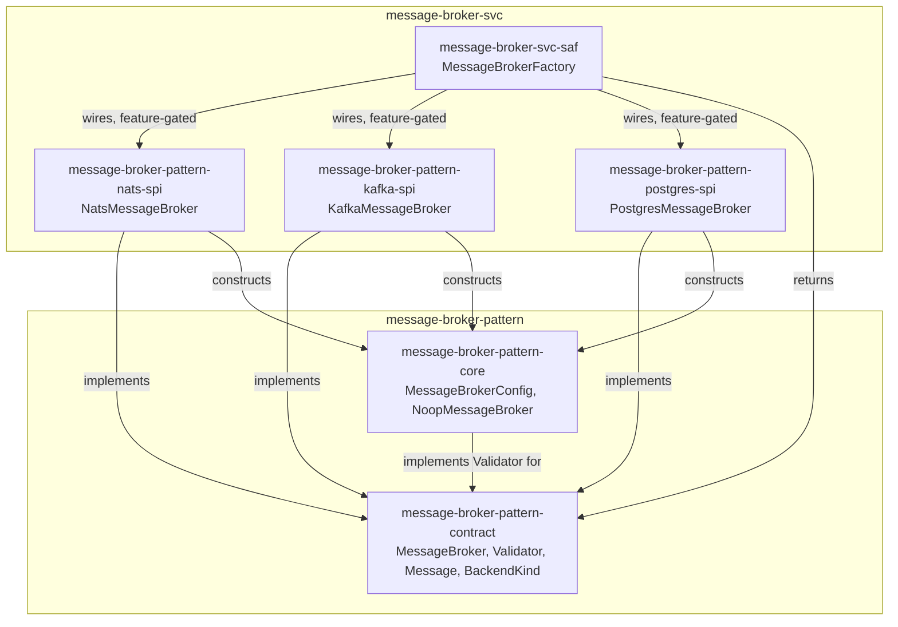

# message-broker-svc Architecture

## Overview

Four crates — three `spi` providers and one `saf` facade:

- **`message-broker-pattern-nats-spi`** (`scm/main/message-broker/spi/nats-spi`) —
  `NatsMessageBroker`, backed by `async-nats`.
- **`message-broker-pattern-kafka-spi`** (`scm/main/message-broker/spi/kafka-spi`) —
  `KafkaMessageBroker`, backed by `rdkafka`. Each `subscribe()` call derives its own
  unique consumer-group ID so multiple subscribers fan out (pub/sub) rather than
  compete for partitions (Kafka's native behavior within one group).
- **`message-broker-pattern-postgres-spi`** (`scm/main/message-broker/spi/postgres-spi`) —
  `PostgresMessageBroker`, backed by `sqlx` + the `pgmq` Postgres extension. Delivery is
  **queue** semantics (one consumer per message), not broadcast — the one backend here
  that doesn't fan out.
- **`message-broker-svc-saf`** (`scm/main/message-broker/saf`) — `MessageBrokerFactory`,
  the sole construction/dispatch seam. A consumer depends on `message-broker-pattern-contract`
  + `message-broker-svc-saf` alone and never imports a `spi` crate directly — enforced,
  not a convention left to discipline (see `spi_security_test` note in `saf`'s own
  `lib.rs`).

Each `spi` crate depends on `message-broker-pattern-contract` (the `MessageBroker` trait
and value types) and `message-broker-pattern-core` (`MessageBrokerConfig` — every backend
constructs one to hand back from `validator()`, so callers can revalidate a live broker's
configuration without naming the concrete type).

## Component Diagram

## Dispatch

`MessageBrokerFactory::from_config(&MessageBrokerConfig)` matches on
`config.backend: BackendKind` and delegates to the matching `spi` crate's `connect`/`new`
constructor, feature-gated:

| `BackendKind` | Requires | Required config fields |
|---|---|---|
| `Nats` | `nats` feature | `url` |
| `Kafka` | `kafka` feature | `url` (bootstrap brokers), `group_id` |
| `Postgres` | `postgres` feature | `url` (DSN), `queue_name` |
| `InMemory` | — | not constructed here; see [Scope](#scope-boundary) |

A missing feature or a missing required field both return `Err` (`Unavailable`/
`Connection`) — never a panic or a silent default.

## Scope boundary

This repo covers only `message-broker-pattern-contract`'s `MessageBroker` trait, extracted
from `edge-runtime`'s own in-tree pilot (`ec34244`/`16ec508`). Three things from that
pilot were deliberately **not** ported:

- **`TaskQueue`** — `edge-runtime`'s own richer contract
  (`runtime-message-broker-contract`, a superset of this contract adding `TaskQueue`/
  `Task`/`TaskHandle`) and each backend's `*TaskQueue` implementation. `KafkaMessageBroker`
  and `NatsMessageBroker` were split cleanly from their `*TaskQueue` siblings in the
  source they were extracted from (separate files, no shared state), so this was a clean
  cut, not a partial one.
- **`ApplicationConfig`/`BrokerProvider`** — `edge-runtime`-specific composition
  abstractions layered on top of `MessageBrokerFactory`. Not part of
  `message-broker-pattern-contract`, and this repo has no dependency on `edge-runtime`.
- **The in-memory backend** — `edge-runtime` has its own real `tokio::sync::broadcast`-backed
  `InMemoryMessageBroker` (`runtime-message-broker-core`), distinct from
  `message-broker-pattern-core`'s `NoopMessageBroker` (which discards published messages
  rather than broadcasting them). Neither this repo nor `message-broker-pattern` ships that
  real in-memory implementation today — `BackendKind::InMemory` is rejected by
  `MessageBrokerFactory::from_config` here with a message pointing at
  `message-broker-pattern-saf::BrokerSvc::noop_broker` instead.

[← Docs index](../README.md)
